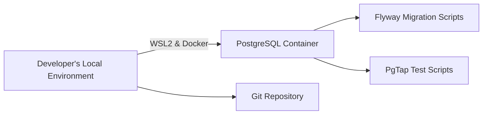

# データベース管理サンプルプロジェクト設計書

## 目次

- [はじめに](#はじめに)
- [目的](#目的)
- [全体アーキテクチャ](#全体アーキテクチャ)
- [動作環境](#動作環境)
- [採用ツールと技術](#採用ツールと技術)
- [プロジェクト構成](#プロジェクト構成)
- [詳細設計](#詳細設計)
  - [1. Docker 設定](#1-docker設定)
  - [2. PostgreSQL 構成](#2-postgresql構成)
  - [3. マイグレーション戦略（Flyway）](#3-マイグレーション戦略flyway)
  - [4. テスト戦略（PgTap）](#4-テスト戦略pgtap)
  - [5. Git によるバージョン管理と差分管理](#5-gitによるバージョン管理と差分管理)
- [CI/CD の構成例](#cicdの構成例)
- [運用と拡張性](#運用と拡張性)
- [参考資料](#参考資料)

## はじめに

本プロジェクトは、データベース管理のベストプラクティスを検討するためのサンプルプロジェクトです。WSL2 上で Docker を稼働させ、PostgreSQL コンテナを利用することで、どのローカル環境でも一貫性のあるデータベース環境を構築することを目的としています。なお、WSL2 上に直接 Docker エンジンをインストールする前提としています。

## 目的

- **一貫したデータベース環境構築**: 各ローカル端末で同一の DB 環境（DDL/DML 含む）を WSL2 上の Docker で構築する。
- **バージョン管理**: Git によりデータベースの定義や変更を差分管理し、変更履歴としてのトレーサビリティを確保する。
- **マイグレーション管理**: Flyway を用いてデータベースのマイグレーションを自動実行し、アップグレード/ロールバックを容易にする。
- **テスト自動化**: PgTap を使用してデータベースのテストコードを実行し、変更の品質保証を実現する。

## 全体アーキテクチャ

以下は本プロジェクトの全体構成の概要です。



- **Developer's Local Environment**: Windows 環境上で WSL2 に直接インストールした Docker エンジンを利用して、各開発者が同一のコンテナを起動可能。
- **PostgreSQL Container**: コンテナ内に PostgreSQL を立ち上げ、DDL/DML の適用対象となる DB サーバーを構築。
- **Flyway Migration Scripts**: マイグレーション用の SQL スクリプト群を格納し、コンテナ起動時に自動実行。
- **PgTap Test Scripts**: テストコードを記述し、データベーススキーマの妥当性を検証する。
- **Git Repository**: 全てのマイグレーションスクリプト、DDL/DML 定義、テストコード、および設定ファイルを管理。

## 動作環境

- **OS**: Windows 10/11（WSL2 利用推奨、Docker Desktop for Windows は使用しない）
- **Docker**: WSL2 上に直接インストール（例：Ubuntu ディストリビューション内で Docker CE を利用）
- **PostgreSQL**: 任意のバージョン（例：PostgreSQL 13/14）
- **Flyway**: オープンソースエディション（CLI またはプラグイン利用）
- **PgTap**: PostgreSQL 用ユニットテストフレームワーク

## 採用ツールと技術

- **Docker/WSL2**: WSL2 上に直接 Docker をインストールすることで、ローカル環境での一貫性ある開発環境を提供
- **PostgreSQL**: リレーショナルデータベース管理システム
- **Git**: ソースコードおよび DB 定義ファイルのバージョン管理・差分管理
- **Flyway**: データベーススキーマのバージョン管理とマイグレーション自動化ツール
- **PgTap**: SQL ベースのユニットテストツール

## プロジェクト構成

以下は、Git リポジトリ内でのディレクトリ構成の一例です。

```bash
/db-sample-project
├── docker
│   ├── Dockerfile
│   └── docker-compose.yml
├── migrations
│   ├── V1__initial_schema.sql
│   ├── V2__add_sample_data.sql
│   └── ...
├── tests
│   ├── test_schema.sql
│   └── test_data.sql
├── scripts
│   ├── run_migrations.sh
│   └── run_tests.sh
└── README.md
```

### docker/

- **Dockerfile**: PostgreSQL コンテナのベースイメージおよび必要なツール（Flyway, PgTap）のインストール手順。
- **docker-compose.yml**: WSL2 上でコンテナを立ち上げるための設定ファイル。

### migrations/

マイグレーション用 SQL スクリプト群。命名規則は Flyway に準拠（例：V1\_\_initial_schema.sql）。

### tests/

PgTap を用いたテストコード。スキーマの整合性やデータの妥当性チェックを実施。

### scripts/

シェルスクリプト等を格納。run_migrations.sh は Flyway の自動実行、run_tests.sh は PgTap のテスト実行用。

### README.md

プロジェクト概要、セットアップ手順、運用方法の記載。

## 詳細設計

### 1. Docker 設定

#### Dockerfile:

- ベースイメージとして公式 PostgreSQL イメージを利用。
- 必要なツール（Flyway CLI、PgTap 拡張）のインストールを実施。
- コンテナ起動時に、初期化スクリプトディレクトリに格納された SQL スクリプトを実行する仕組みを構築。

#### docker-compose.yml:

- サービス名（例：db）を定義。
- ボリュームマウントにより、ホスト側の migrations/や tests/ディレクトリをコンテナ内にマウントし、開発中のスクリプトの自動反映を実現。
- ネットワークの設定で、ローカルホストからアクセス可能とする。

### 2. PostgreSQL 構成

#### 初期設定:

- コンテナ起動時に、環境変数（例：POSTGRES_USER, POSTGRES_PASSWORD, POSTGRES_DB など）で初期ユーザ・データベースの作成。
- 初期化ディレクトリ（/docker-entrypoint-initdb.d）に配置された初期 SQL スクリプトによる基本スキーマの作成。

#### 拡張モジュール:

- PgTap を利用するため、CREATE EXTENSION pgtap; を適用（テスト用 DB または対象 DB に対して）。

### 3. マイグレーション戦略（Flyway）

#### ファイル命名規則:

- V<バージョン番号>**<概要>.sql 形式で管理（例：V1**initial_schema.sql）。
- 変更があるたびに新たなスクリプトを追加し、過去のスクリプトは変更しない。

#### 実行方法:

- run_migrations.sh スクリプトを用いて、コンテナ起動時または CI/CD パイプライン内で自動実行。
- Flyway の設定ファイル（例：flyway.conf）により、接続先情報やマイグレーションスクリプトのパスを定義。

#### バージョン管理:

- Git リポジトリ内で、マイグレーションスクリプトの変更履歴を管理。
- チームでの開発時、プルリクエストを用いてマイグレーションスクリプトの変更をレビューするプロセスを導入。

### 4. テスト戦略（PgTap）

#### テスト対象:

- スキーマ整合性（テーブル、カラム、インデックスの存在チェック）
- データ整合性（サンプルデータの内容確認）
- ルール、トリガーの動作確認

#### 実行方法:

- run_tests.sh スクリプトにより、PgTap テストスクリプト（tests/以下）を実行。
- テスト結果は標準出力にレポートし、CI/CD での自動実行時に結果を失敗条件とする。

#### サンプルテスト例:

```sql
-- tests/test_schema.sql
SELECT plan(3);

-- テーブルの存在チェック
SELECT has_table('public', 'users'), 'テーブル "users" が存在すること';

-- カラムの存在チェック
SELECT has_column('public.users', 'email'), 'テーブル "users" に "email" カラムが存在すること';

-- インデックスの存在チェック
SELECT has_index('public.users', 'users_email_idx'), 'インデックス "users_email_idx" が存在すること';

SELECT * FROM finish();
```

### 5. Git によるバージョン管理と差分管理

#### 管理対象:

- マイグレーションスクリプト（DDL、DML）
- テストコード（PgTap 用 SQL ファイル）
- Docker 関連設定ファイル（Dockerfile, docker-compose.yml）
- 各種シェルスクリプト（実行、CI/CD 用）

#### ブランチ戦略:

- メインブランチは常に安定版の状態を維持。
- 新規機能/変更は機能ブランチで実施し、プルリクエストでレビュー後にマージ。

#### コミットメッセージ:

- 明瞭かつ一貫性のある形式（例：「V3\_\_add_new_table」）でコミット。
- マイグレーションスクリプト追加時は、内容に対する詳細な説明をコメントとして残す。

## CI/CD の構成例

- **CI/CD ツール**: GitHub Actions、GitLab CI などを利用して、自動ビルド・テストパイプラインを構築。

### パイプライン例:

1. WSL2 上にインストールした Docker を利用し、PostgreSQL コンテナを起動。
2. run_migrations.sh で Flyway によるマイグレーションを実行。
3. run_tests.sh で PgTap テストスクリプトを実行。
4. テスト結果が成功した場合、マージまたはデプロイを実施。

### 自動テスト:

マージ前のプルリクエストで全テストがパスすることを必須条件とする。

## 運用と拡張性

### ローカル環境での再現性:

- WSL2 上で直接 Docker を運用することで、各開発者が同一のデータベース環境を容易に再現可能。
- バージョン管理されたマイグレーションスクリプトにより、環境間の不整合を回避。

### 変更履歴の追跡:

- Git のコミット履歴および Flyway のメタデータテーブル（flyway_schema_history）により、各マイグレーションの適用履歴を確認可能。

### 将来的な拡張:

- データベースのスケーリングやクラウドへの移行を視野に入れた拡張設計。
- テスト自動化をさらに高度化し、パフォーマンスやセキュリティテストを追加する。

## 参考資料

- [PostgreSQL 公式ドキュメント](https://www.postgresql.org/docs/)
- [Flyway 公式サイト](https://www.red-gate.com/products/flyway/community/)
- [PgTap 公式サイト](https://pgtap.org/)
- [Git 運用のベストプラクティス](https://git-scm.com/book/ja/v2)
